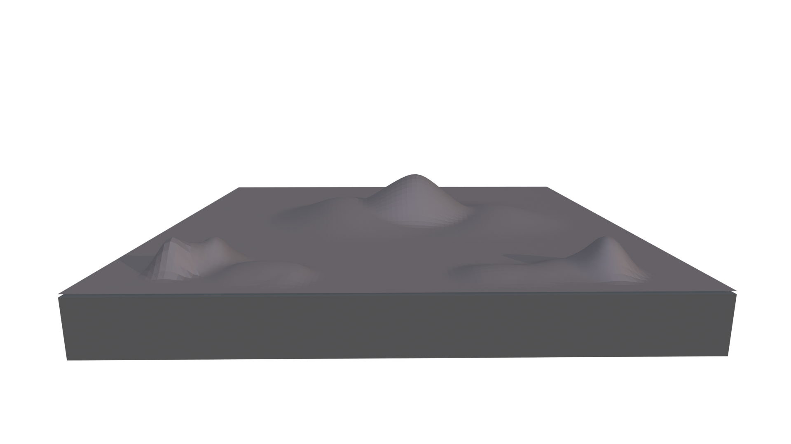
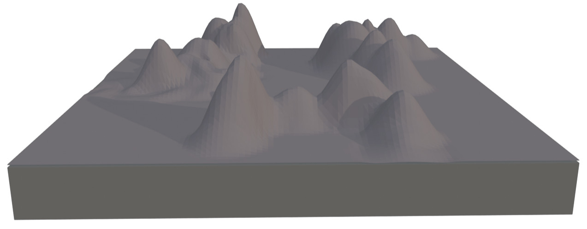
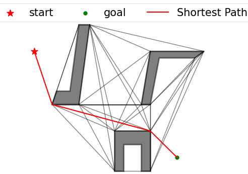
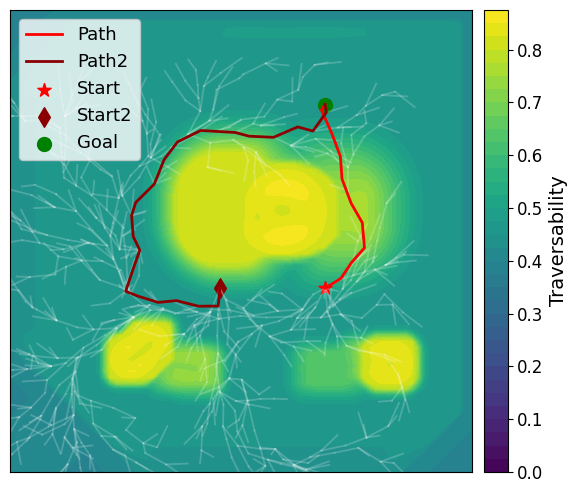
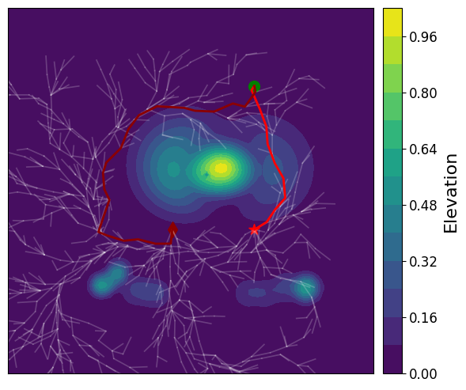
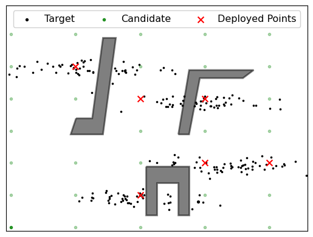
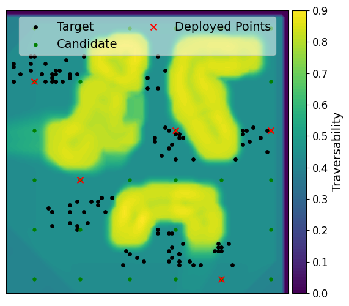
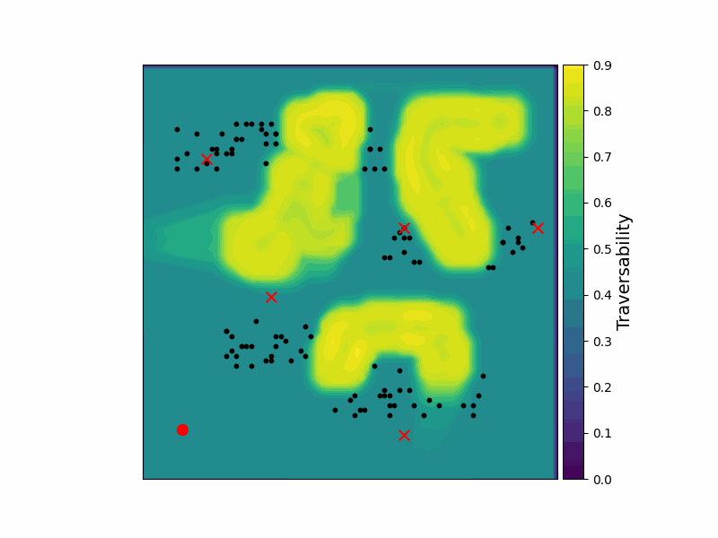

# Multi-Agent Coverage in Non-Convex and Uneven Environments via Exampler Clustering

This repository contains the implementation of a multi-agent coverage strategy using exemplar clustering for optimal deployment points where the distance metrics are defined using visibility graph and traversability based RRT*.

## Requirements

Before running the scripts, you need to  the PyVisGraph package or use the package in this repo:

Install from the source:

```bash
git clone https://github.com/TaipanRex/pyvisgraph.git
cd pyvisgraph
pip install -e .
```
additional requirements 
```bash
pip install -r requirements.txt
```
## Terrain Environments

We use two different terrains created in Blender. The initial blender file was sourced from the following paper and github repo [Gaussian Process-based Traversability Analysis for Terrain Mapless Navigation](https://github.com/abeleinin/gp-navigation).  

**Hilly Terrain 1**:
<p align="center">
  
</p>

**Hilly Terrain 2**:
<p align="center">
  
</p>

## Running the Experiments

### 1. Visibility Graph Generation
Check 
```bash
scripts/visibility_graph_2025.ipynb
```

The visibility graph provides efficient path planning by connecting visible points in the environment:

<p align="center">
  
</p>

### 2. RRT Path Planning with Traversability

Run the RRT path planner that accounts for terrain traversability:

```bash
python scripts/RRT_start_traversability.py
```

This will generate traversability and elevation maps showing optimal paths:

**Traversability Map**:
<p align="center">
  
</p>

**Elevation Map**:
<p align="center">
  
</p>

### 3. Visibility Graph for Deployment

The visibility graph helps identify optimal deployment locations for multi-agent coverage in non-convex environment:
Check 
```bash
scripts/visibility_graph_2025.ipynb
```

<p align="center">
  
</p>

### 4. Traversability Graph for deployment

Finally, run the deployment policy script to determine the optimal placement of agents:

```bash
python scripts/deployment_policy.py
```

This script uses exemplar clustering to identify the best positions for deploying agents to maximize coverage while considering terrain traversability constraints.

<p align="center">
  
</p>

The figures directory contains all the result visualizations from the experiments. The deployment policy uses a sequential greedy approach to identify exemplar points that provide optimal coverage of the target region.

The animation below shows the simulated trajectories of agents reaching their final deployment positions:

<p align="center">
  
</p>

## Acknowledgements
We want to thank the authors of the following repositories: [Gaussian Process-based Traversability Analysis for Terrain Mapless Navigation](https://github.com/abeleinin/gp-navigation) and [Pyvisgraph](https://github.com/TaipanRex/pyvisgraph.git)

We have also released the terrain dae file for people who want to build upon it.